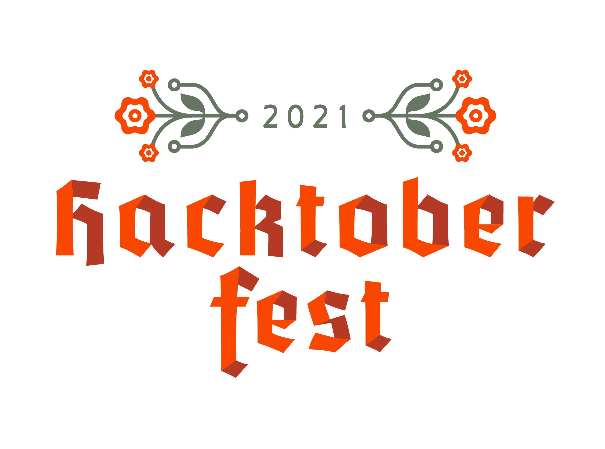

# Contributing to ManimWeb for Hacktoberfest

If you want to contribute to Manim Web, there is some documentation you might want to read:
- this file
- the [CONTRIBUTING.md](CONTRIBUTING.md) file

If you want some help, you can talk in the [Discord server](https://discord.gg/2vRqjpk247).

Contributions can be:
- Adding documentation
- Adding examples
- Adding new Mobjects
- Adding new animations

For the last two, it could be translating existing [Manim](https://github.com/3b1b/manim) or [Manim CE](https://github.com/ManimCommunity/manim) animations / mobjects from Python to Dart.

Finally, don't forget to add you names to [CONTRIBUTORS.md](CONTRIBUTORS.md).

All of the changes will be send to pub.dev at the end of the month.

 

Thanks for taking time to contribute,  
Good luck!