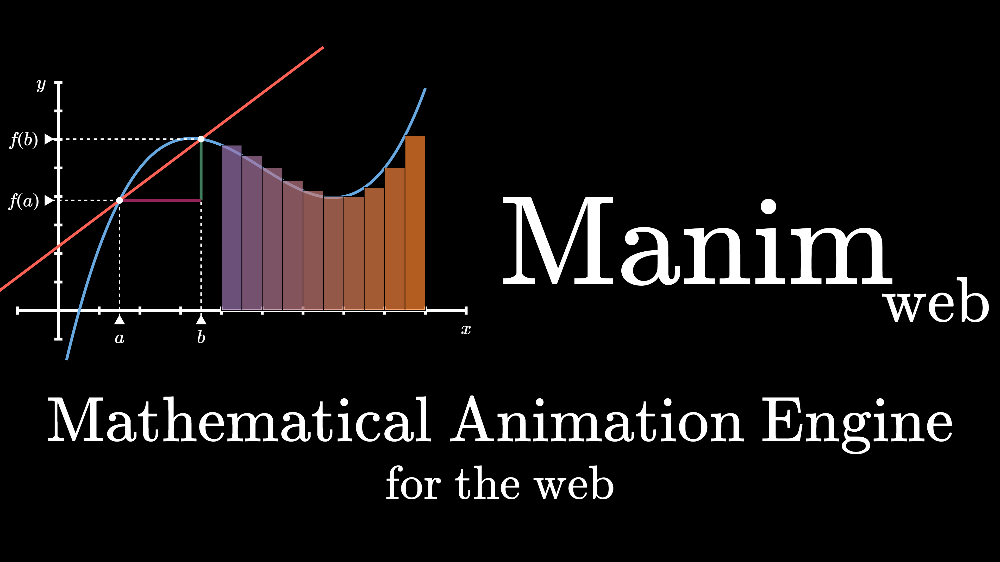

# 

Manim animation engine, for the web.

[Changelog](CHANGELOG.md) | [Manim](https://github.com/3b1b/manim) | [Suggestions / Improvements](IMPROVEMENTS.md) | [FAQ](FAQ.md) | [Discord Server](https://discord.gg/2vRqjpk247)

## Getting started

You need to have the `Dart SDK` installed on your computer (with version between 2.13.0 included and 3.0.0 excluded).

You will also have to activate `webdev` with `dart pub global activate webdev`.

Then you will need to get all of the dependencies: `dart pub get`.

Finally, you can run the dev server with `webdev serve {folder}` to serve a folder (by default the folder is `web`)

## Examples

You can find examples of animations built with Manim-Web [here](https://manim-web.github.io/manim-web/).
The code is available in this repository, in the `example` folder.

You can also serve examples with `webdev serve example`

## Contributing

Contributions are always welcome whether it's code, documentation, examples or even improvements to make.
You can take a look at the [contribution document](CONTRIBUTING.md), there are more details about the whole process. If you want to talk, there is a [discord server](https://discord.gg/2vRqjpk247).
